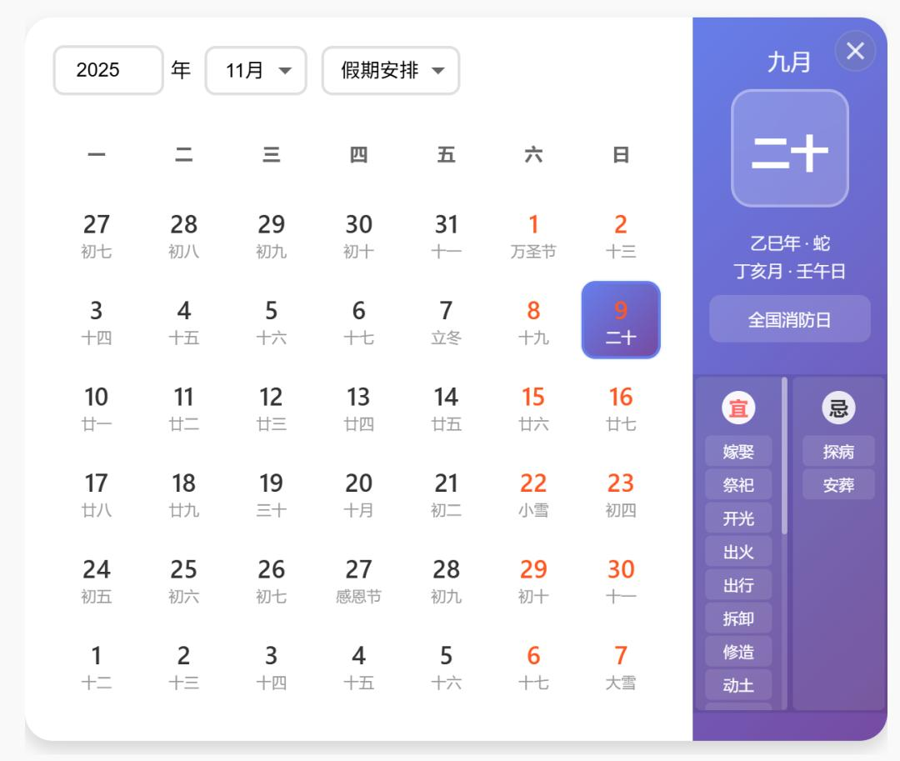
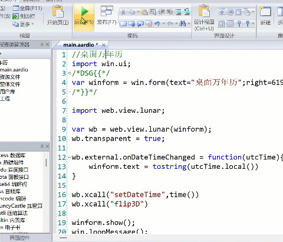

# aardio 扩展库 time.tyme 
 
根据 [Tyme](https://github.com/6tail/tyme4ts) 的 typescript 版本通过 AI 转换为 aardio 版，暂时还不完善。  

调用范例：

```aardio 
import console;
import time.tyme;

var SolarDay = time.tyme.SolarDay;
 
var solar = SolarDay.fromYmd(1986, 5, 29);
 
// 1986年5月29日
console.log( tostring(solar) ); // console.log 的参数可以省略 tostring 调用。

// 农历丙寅年四月廿一
console.log( tostring(solar.getLunarDay()) ); // tostring 可省略

// 第十七饶迥火虎年四月廿一
console.log( tostring(solar.getRabByungDay()) ); // tostring 可省略

console.pause();
```

在 aardio 可以直接使用 Tyme typescript 版，我写的教程与例子：

[AI 编程入门：炫酷桌面万年历（农历、透明背景、3D 翻转动画）](https://mp.weixin.qq.com/s/XQLfulXHTm3XaryyowZKrg)

运行效果：



动画：

